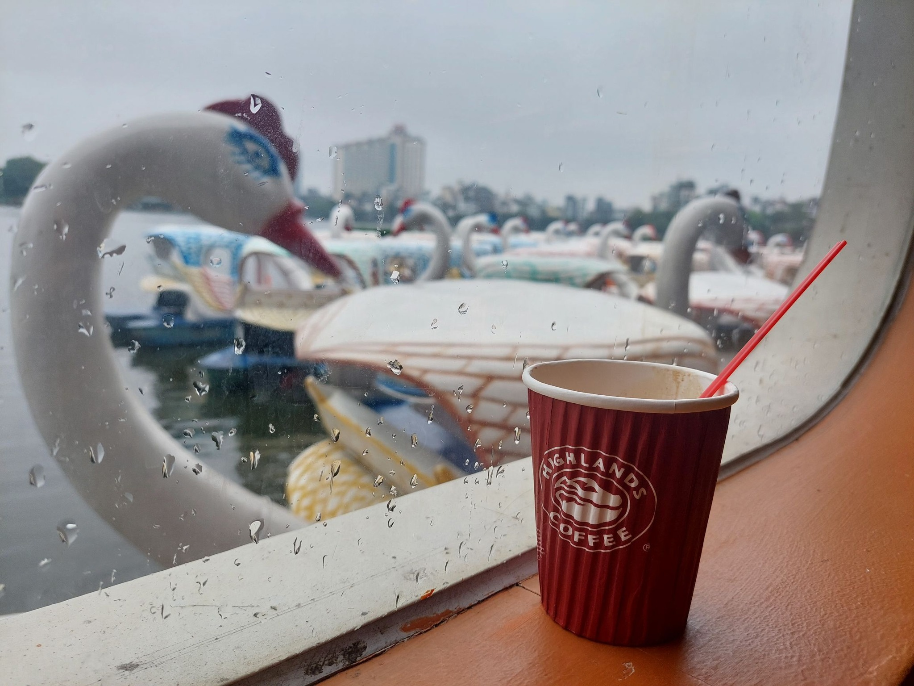

# Savoring the Taste of Coffee Amidst Urban Life

- In the bustling pace of city life, there is nothing more delightful than pausing to enjoy a fragrant cup of coffee. The image below captures this serene moment perfectly, with a steaming cup of coffee placed in the midst of a busy street.

- In this setting, coffee is not just a beverage; it is a symbol of relaxation, connection, and moments of enjoying life. The rich flavor of coffee blends seamlessly with the bustling sounds of the city, creating an unforgettable experience.

- A cup of coffee in the heart of the city not only helps you recharge but also provides an opportunity to reflect, feel, and find peace amidst the chaos of everyday life. Take a moment for yourself, find a sidewalk café, and savor every sip of that robust coffee. You'll find that life suddenly becomes more gentle and meaningful.

## History and Culture of Coffee

Coffee has been an integral part of the culinary culture of many countries for a long time. Each place has its own unique way of enjoying coffee, but the common goal is to bring a sense of relaxation and comfort to the drinker. From luxurious cafés in five-star hotels to small roadside cafés, each place has its own distinct charm but offers customers unforgettable experiences.

## The Origins and Spread of Coffee

Coffee originated in Ethiopia and was introduced to various countries, each developing its unique coffee styles. In Italy, one can easily find small, strong espresso shots, while in France, coffee is often prepared with milk and sugar, creating rich cappuccinos.

In Vietnam, coffee has also become an essential part of daily life. Vietnamese people enjoy their coffee brewed through a phin filter, allowing hot water to drip through the coffee grounds. Once brewed, a bit of sugar or condensed milk is added to create the distinctive flavor. Enjoying phin coffee is a delightful experience, as each drop falls into the cup, releasing a fragrant aroma throughout the space.

## Coffee and Modern Life

In modern life, coffee is more than just a beverage to stay alert; it is a symbol of connection. In major cities, it is not hard to see young people gathering at coffee shops, chatting, working, or simply watching the world go by. Coffee has become an essential part of urban life, where people can find moments of peace in a fast-paced world.

Coffee is also a staple in office culture. In many companies, starting the workday with a cup of coffee has become a habit for many employees. Coffee not only helps them stay alert but also offers an opportunity to connect, discuss work, and build relationships with colleagues.

## The Art of Enjoying Coffee

Enjoying coffee is an art. From selecting the type of coffee beans, the roasting process, to the brewing method, every step affects the final flavor of the coffee. Everyone has their own way of enjoying coffee, but the common goal is to find the perfect taste.

In upscale coffee shops, there is an emphasis on creating a luxurious coffee-drinking experience. Comfortable seating, soft lighting, and gentle jazz music all contribute to an ideal space for enjoying coffee. Here, one can immerse themselves in the atmosphere, savoring each sip and experiencing the distinctive flavors.

In roadside coffee shops, although the setting is simpler, it offers unique experiences. Sitting on simple plastic chairs, watching the bustling street, sipping on a delicious cup of coffee—this is also a way to find peace in life.

## Connection and Sharing

Coffee is more than just a drink; it is a bridge that connects people. Meetings, gatherings with friends, or business discussions often start with a cup of coffee. In the cozy atmosphere of a coffee shop, people can easily open up, share their stories, and listen to others.

In the digital age, coffee has also become a part of online meetings. Virtual meetings on Zoom, Teams, or Google Meet often feature a cup of coffee beside the participants. Coffee not only keeps everyone alert but also fosters a sense of closeness and friendliness during online meetings.

## The Growth of the Coffee Industry

The coffee industry has seen significant growth in recent years, from cultivation, production to distribution. Countries like Brazil, Vietnam, and Colombia are the largest coffee producers globally, supplying high-quality coffee beans to international markets.

Famous coffee chains like Starbucks, Costa Coffee, and The Coffee Bean & Tea Leaf have expanded their networks worldwide, offering customers premium coffee experiences. Meanwhile, independent coffee shops continue to thrive, creating unique and stylish coffee-drinking spaces.

## Coffee and Health

Coffee is not just a delicious beverage but also offers numerous health benefits. Studies have shown that drinking coffee in moderation can reduce the risk of diseases like diabetes, Parkinson's, and Alzheimer's. Coffee also contains antioxidants that protect cells from environmental damage.

However, coffee should be consumed in moderation. Drinking too much coffee can lead to health issues such as insomnia, anxiety, or high blood pressure. Therefore, enjoy coffee wisely to reap its benefits.

## Conclusion

A cup of coffee amidst the city's hustle and bustle is more than just a beverage; it is a symbol of relaxation, connection, and enjoying life. Take some time for yourself, find a sidewalk café, and savor every sip of that robust coffee. You'll find that life suddenly becomes more gentle and meaningful.

From luxurious coffee shops to roadside cafés, each place offers unique experiences. Coffee not only helps you recharge but also provides an opportunity to reflect, feel, and find peace amidst the chaos of everyday life. Enjoying coffee is an art, and everyone has their own way of savoring it. Find your style of coffee enjoyment and relish the wonderful moments it brings.

The coffee industry is thriving, bringing high-quality coffee beans and premium coffee experiences to customers. Coffee is not just a delicious beverage but also offers numerous health benefits. However, it should be consumed in moderation to enjoy its benefits fully.

Coffee is an indispensable part of modern life. Take time to find peace amidst the city's hustle, savor a fragrant cup of coffee, and appreciate the wonderful things life has to offer.
