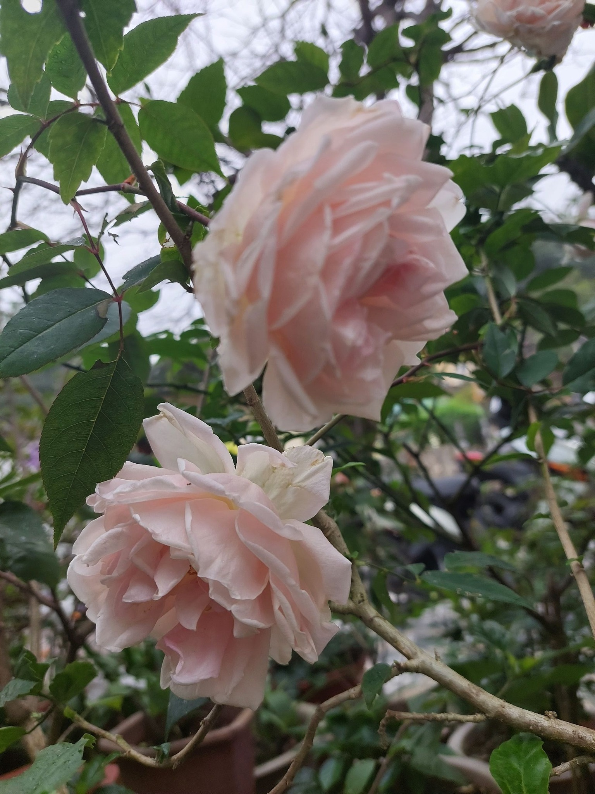
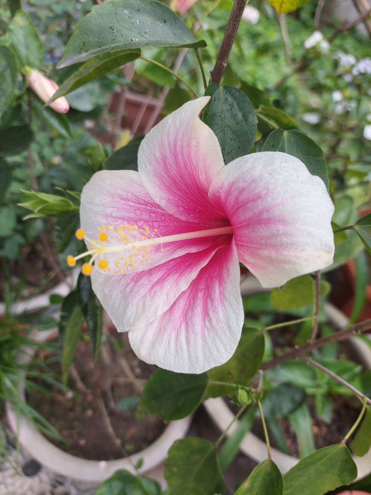
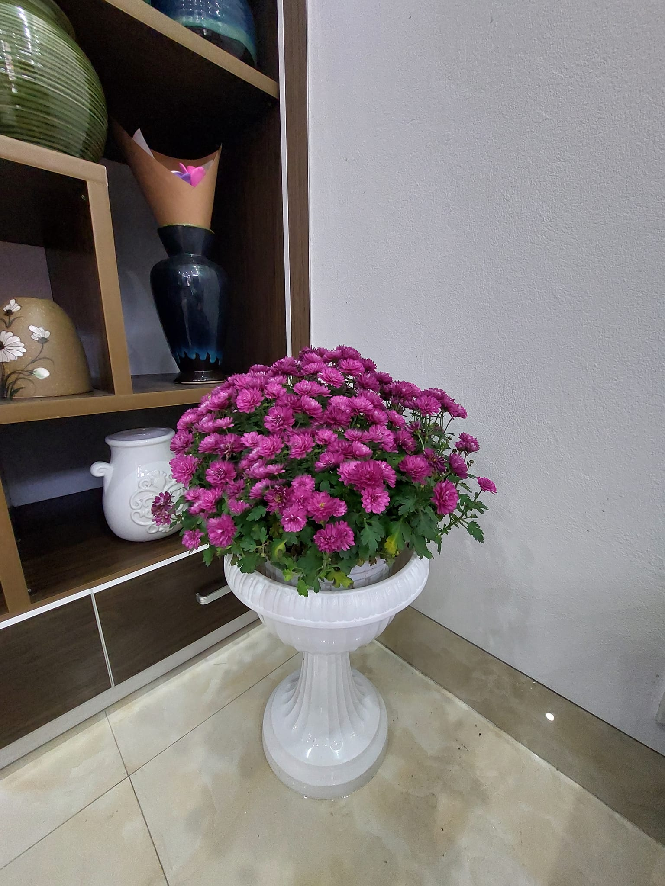
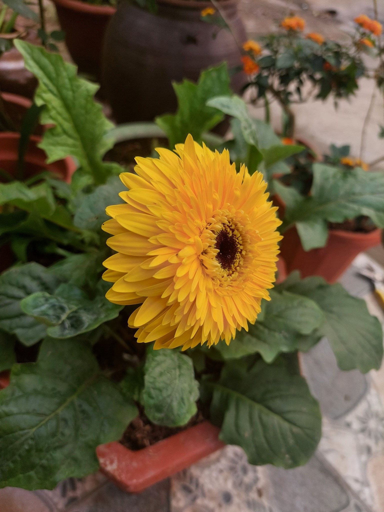
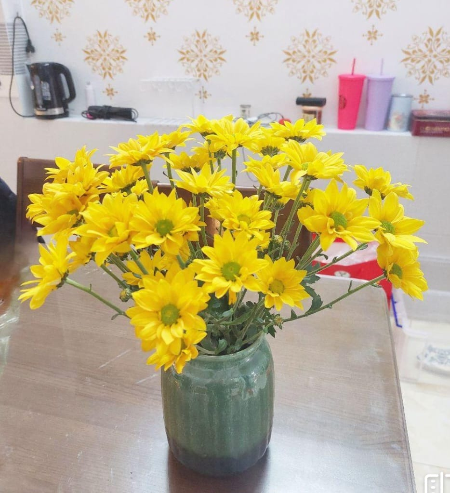

# The World of Flowers: Gladiolus and Marigold

Flowers, with their vibrant colors and enchanting fragrances, have always held a special place in human culture and history. They symbolize a myriad of emotions and events, from love and happiness to mourning and remembrance. Among the vast array of flowers, the gladiolus and marigold stand out not only for their beauty but also for their rich symbolism and diverse uses. This article delves into the fascinating world of these two flowers, exploring their origins, characteristics, cultural significance, and practical applications.

## Marigold: The Golden Flower

### Origins and Characteristics

Marigolds, with their bright and cheerful hues, are among the most beloved flowers worldwide. Native to the Americas, particularly Mexico and Central America, marigolds belong to the genus Tagetes. There are around 50 species of marigolds, which are commonly categorized into two groups: African marigolds (Tagetes erecta) and French marigolds (Tagetes patula).

Marigolds are known for their vibrant colors, which range from yellow and gold to orange and red. The flowers have a distinct, slightly pungent scent and are characterized by their ruffled petals. Marigolds are annual plants that thrive in warm, sunny environments. They are relatively easy to grow and are often used in garden borders, flower beds, and containers.

### Symbolism and Cultural Significance

Marigolds hold significant cultural and symbolic meanings in various parts of the world. In Mexico, they are known as "cempasúchil" and play a crucial role in the Day of the Dead (Día de los Muertos) celebrations. The bright orange and yellow marigolds are used to decorate altars and graves, guiding the spirits of the deceased back to the world of the living. The strong scent of the flowers is believed to attract and lead the souls of the departed.

In Hindu culture, marigolds are considered sacred and are commonly used in religious ceremonies and rituals. They are often used to make garlands and decorate temples, offering a vibrant display of devotion and reverence to the gods. Marigolds are also associated with the sun and are believed to symbolize warmth, positive energy, and new beginnings.

In the language of flowers, marigolds represent passion and creativity. Their bright colors and bold presence make them a popular choice for expressing enthusiasm and joy. However, in some cultures, they are also associated with mourning and grief, symbolizing the cycle of life and death.

### Practical Uses

Marigolds have a variety of practical uses beyond their ornamental value. One of their most notable uses is in gardening, where they serve as natural pest repellents. The strong scent of marigolds is known to deter pests such as aphids, nematodes, and mosquitoes. Gardeners often plant marigolds alongside vegetables and other susceptible plants to protect them from insect infestations.

In addition to their pest-repelling properties, marigolds have medicinal uses. In traditional medicine, marigold extracts are used for their anti-inflammatory and antiseptic properties. The flowers are believed to aid in wound healing, reduce skin inflammation, and alleviate digestive issues. Marigold tea, made from the dried petals, is sometimes consumed for its potential health benefits.

Marigolds are also used in the culinary world. In some cultures, the petals are used as a natural food coloring and flavoring agent. The petals can be added to salads, soups, and rice dishes, providing both color and a mild, tangy flavor. Marigold petals are also used to produce a yellow dye, which is used in textiles and cosmetics.

## Conclusion

The gladiolus and marigold are two remarkable flowers that captivate us with their beauty, symbolism, and versatility. From the towering spikes of gladiolus blooms to the bright and cheerful marigold petals, these flowers enrich our gardens, ceremonies, and everyday lives. Their rich histories and cultural significance remind us of the deep connection between humans and the natural world. As we continue to cultivate and celebrate these flowers, we honor the enduring legacy of their beauty and the myriad ways they touch our lives.

**_Author: Nguyễn Minh Chí_**

**_Contact email: minhchico300kc@hotmail.com_**
